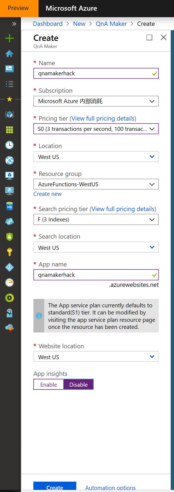
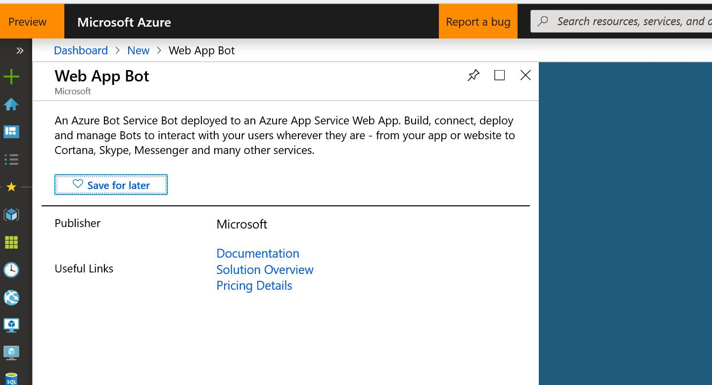
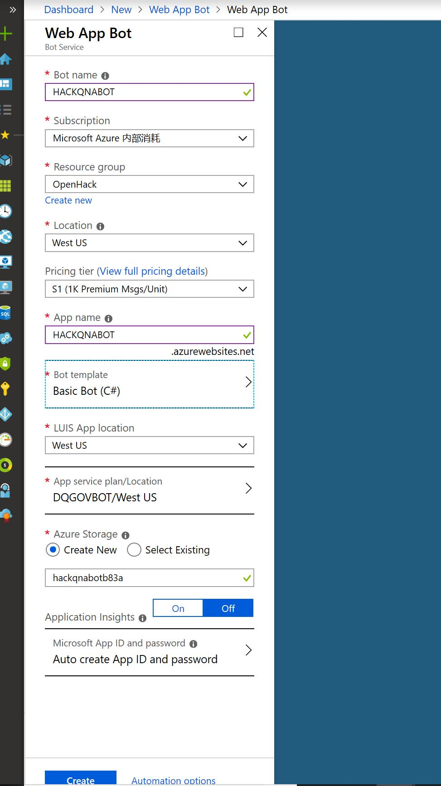
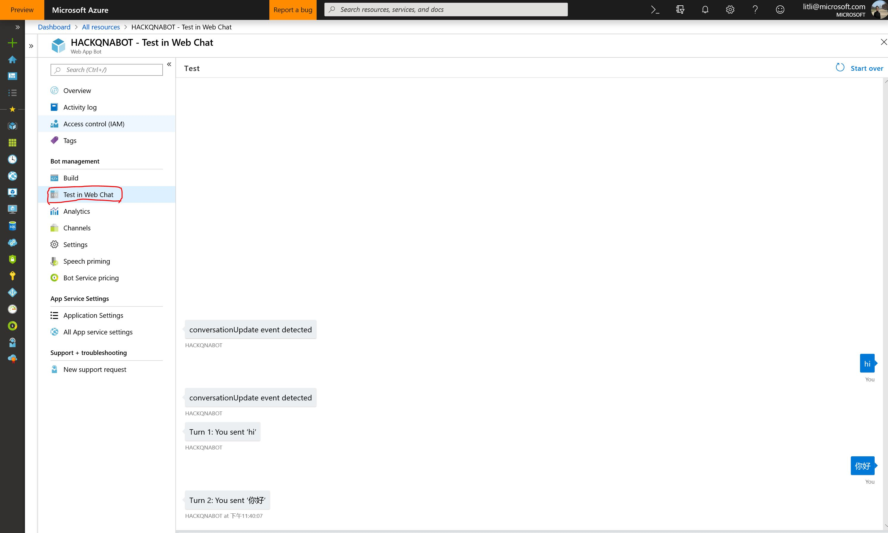
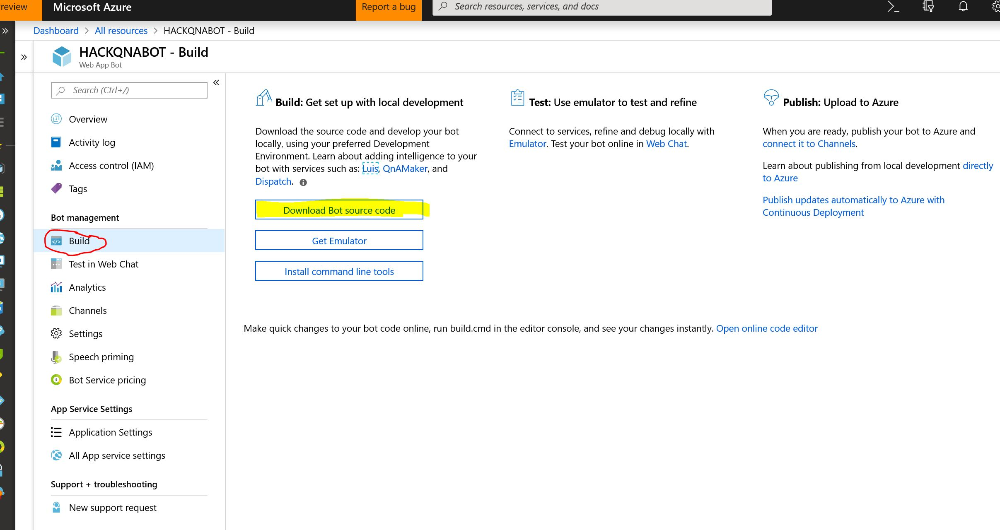
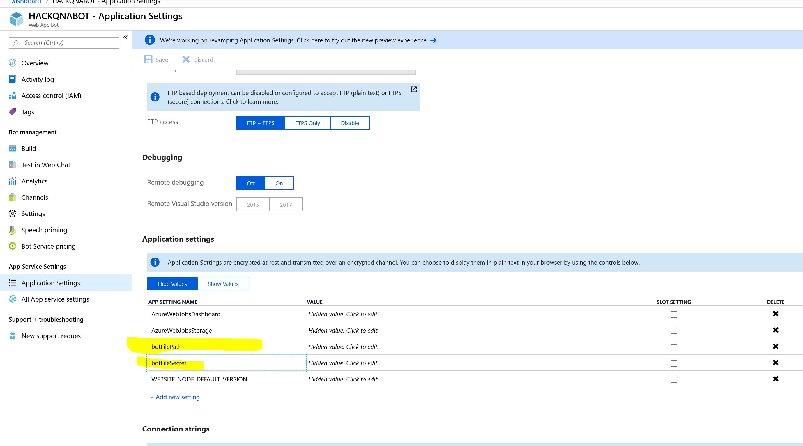
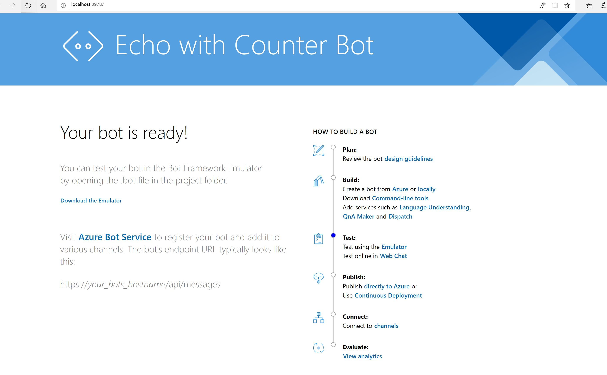
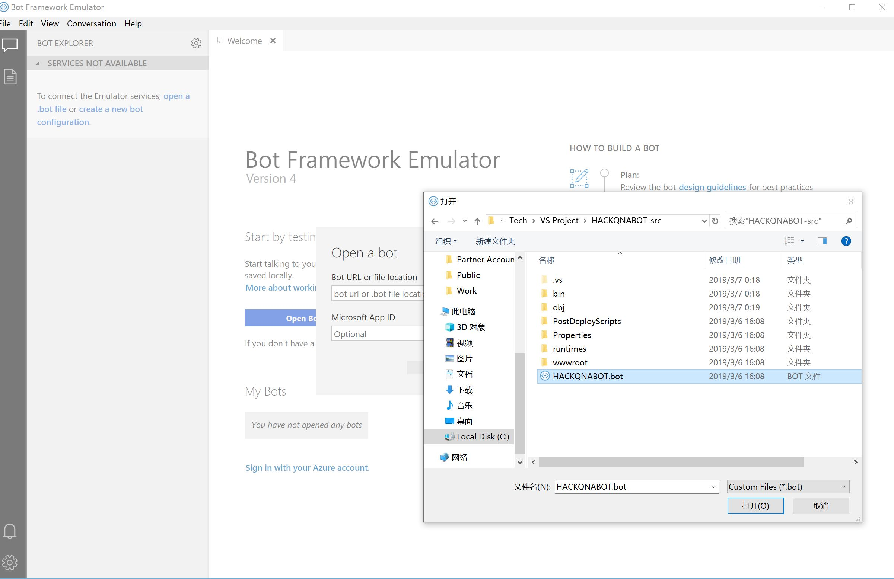
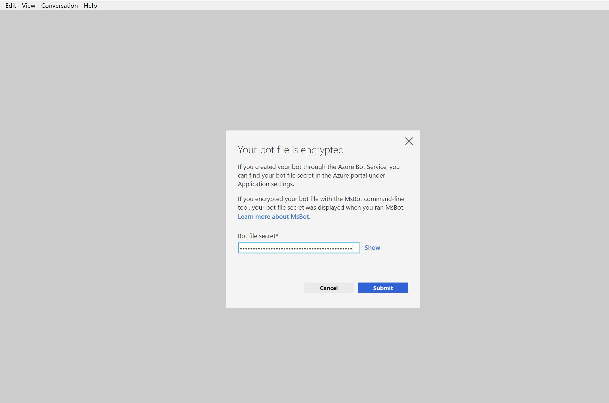
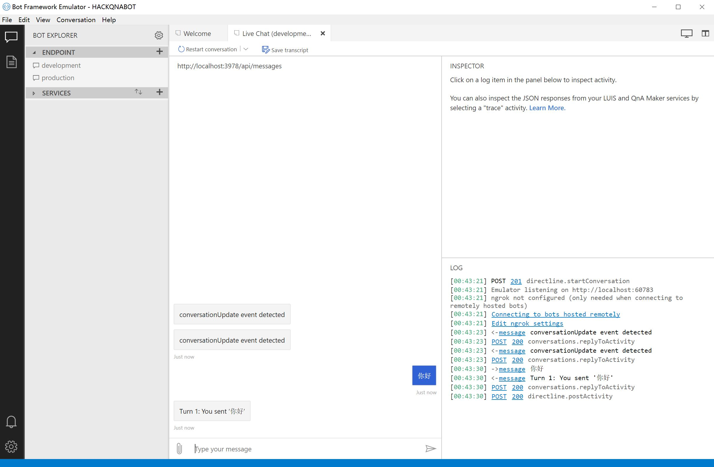

# 基于QnA Maker的问答机器人
这个实验会介绍如何使用QnAMaker轻松创建一个问答帮助机器人的服务，并使用Azure Bot Services集成该QnA服务实现一个可以在Skype/Web沟通的机器人样例。本样例主要包括以下几部分内容：
- 创建QnA服务
- 创建问答机器人Bot Service
- 集成开发问答机器人QnA服务
- 注册发布问答机器人
- 测试问答机器人
  
## 实验条件
1. 需要有Microsoft Azure国际版订阅
2. 需要下载[Bot Emulator](https://github.com/Microsoft/BotFramework-Emulator/releases/tag/v4.3.0)
3. 需要[Visual Studios 2017](https://visualstudio.microsoft.com/zh-hans/downloads/?rr=https%3A%2F%2Fdocs.microsoft.com%2Fen-us%2Fazure%2Fbot-service%2Fbot-builder-tutorial-basic-deploy%3Fview%3Dazure-bot-service-4.0%26tabs%3Dcsharp)以上版本
4. 该实验的服务都创建在同一个资源组，以方便后面做管理


## 创建QnA服务
QnAMaker可以让开发者使用FAQ URL，FAQ文件或者手工录入问题答案等方式，轻松构建一个问答机器人服务。

1. 使用Azure订阅账号登陆[Azure Portal](http://portal.azure.com)，选择+，创建资源，搜索QnAMaker，选择搜索出来的QnA Maker服务，点击Create。
   
   
2. 输入QnA Maker服务的名字，选择订阅，价格，部署地理位置等信息； 其中价格可以选择S0（提交的问题对文档不限量，每月10美金）；Search Price可以选择F(3 Indexes)；本实验不需要监控服务使用情况，可以将App Insights服务Disable，点击Create。
   
   

   创建完成后，就可以开始QnA Maker应用的创建和训练了。
3. 使用Azure订阅账号登陆[QnAMaker门户](http://qnamaker.ai)，点击Create a knowledge base，在第二步中选择你的Azure订阅和你刚刚创建的QnAMaker的服务，输入Knowledge Base的名字，下载训练的问题对文件[样例](./src/qna.txt)，在添加问题对文件处，浏览到你样例文件的下载路径选择样例文件qna.txt，点击Create。
   
    
    
4. KnowledgeBase创建完成后，问题对编辑和训练界面， 可以检查一下导入的文件是否问题对显示正确（样例中有11个问题对），确认后，点击Save and train，进行训练。
   
5. 训练完成后，可以点击Test，进行测试， 输入你需要提问的内容，回车。点击inspect，可以看到后台给出的具体分析，确认问题回答的匹配程度。不满意，可以选择增加或修改答案，然后重新Save and train。直到满意。
   
6. 训练和测试完成后，可以点击Publish，发布应用，发布成功后需要保存其中的**Knowledge BaseID，Endpoint key，和hostname**，后面会用到。

   
创建好QnA查询服务，就可以开始创建Bot Services。

## 创建问答机器人Bot Services
通过创建Bot Services生成问答机器人服务，下载问答机器人项目源码，以进行后续QNA服务集成开发。
1. 使用Azure订阅账号登陆[Azure Portal](http://portal.azure.com)，选择+，创建资源，搜索web app bot，选择搜索出来的web app bot服务，点击Create。
   
2. 输入Bot名字，资源组，选择定价，部署地理位置等，其中价格可以选择S1，Bot Template选Basic Bot(C#)；选择自动创建app id和password，本实验不需要监控Bot的服务的使用情况，可以将App Insights服务Disable，点击Create。
   
3. 创建成功，进入Bot Service，点击Test in web chat， 可以测试该Bot服务情况，这是一个回音BOT，输入“你好”，回复“You sent ‘你好’”。
    
4. 点击Build，进入Build页面，选择Download Bot source code，选择将.ZIP文件保存到你的本地文件目录，并解压缩。
   
5. 点击application Settings，然后点击botFilePath和botFielSecret，保持这两个信息。后面会用到。
   
   
   后面我们就可以开始将QnA服务集成到问答机器人代码中。

## 集成开发问答机器人QnA服务
这里首先，我们将刚刚创建的回音的机器人，在本地做编辑并在emulator中测试，然后现在我们将QNA服务集成进去，让它可以变成一个问答机器人。
1. 点击解压目录下的****.sln文件，在Visual Studio中打开。点击applsetting.json，将上面5步中的botFilePath和botFielSecret复制到这里。
   ```
   {
    "botFilePath": "You can find the botFilePath and botFileSecret in the Azure App Service application settings",
    "botFileSecret": "You can find the botFilePath and botFileSecret in the Azure App Service application settings"
    }
   ```
2. 保存，然后F5进行编译和运行。成功后，会自动弹出web页面显示服务在本地启动。
   
3. 启动实验开始时下载好的Emulator，然后选择OPEN BOT,选择问答机器人工程项目目录下的.bot文件，第一需要输入bot secret，将之前保存的bot secret录入，并选择submit。
   
   
4. Emulator连接本地回音机器人成功后，会在右侧log栏中输出连接成功日志信息。可以输入“你好”做测试。
   
5. 